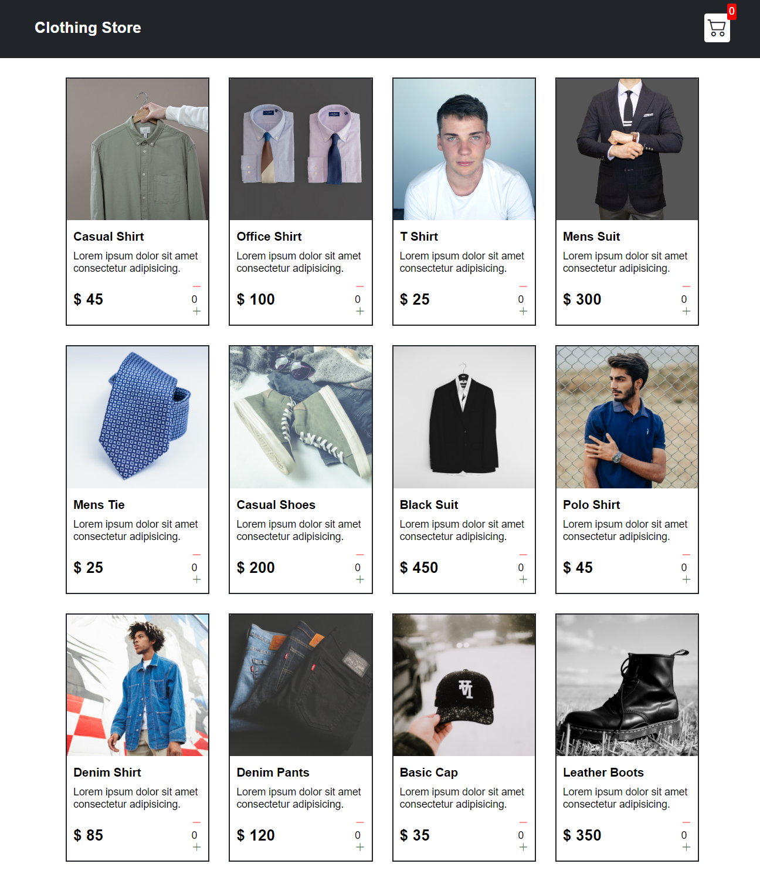
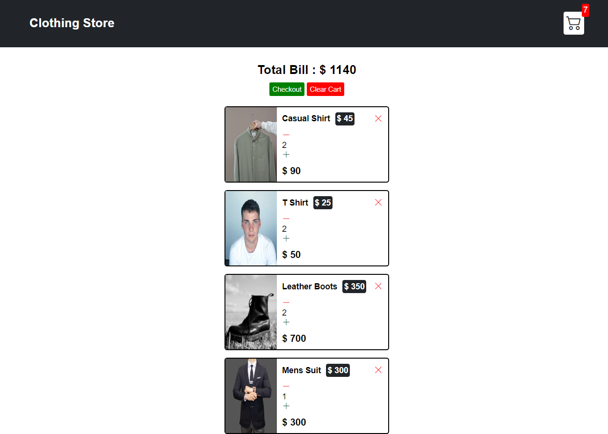
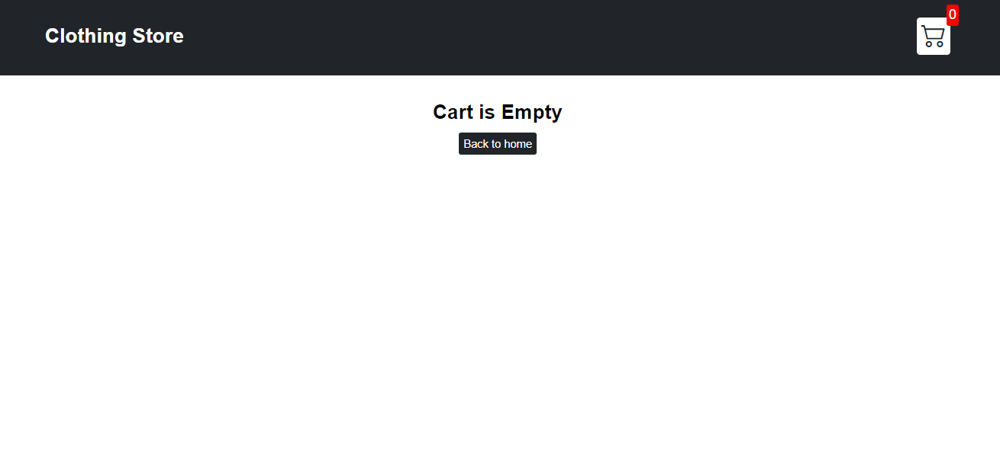

CartSmart

Engineered a feature-rich shopping cart utilizing vanilla JavaScript, showcasing advanced frontend development skills. Applied core JavaScript concepts for dynamic
product handling, cart functionalities, and enhanced user interaction.
Demonstrated adeptness in DOM manipulation and event-driven programming for
a seamless shopping experience.

Checkout on netlify: "https://asiya-shopping-cart.netlify.app/"

Technologies Used

HTML5

CSS

JavaScript

THINGS TO IMPROVE

.Search Functionality: Implement a robust search functionality that allows users to quickly find products based on keywords, categories, or filters. Consider integrating search suggestions or auto-complete to enhance the user experience.

.Social Sharing and Integration: Enable social sharing features to allow users to share their favorite products or purchases with their friends and followers on social media platforms. You could also consider integrating social login options for easier registration and login.

.Product Reviews and Ratings: Allow users to leave reviews and ratings for products they've purchased or viewed. This can help build trust and credibility for your app and provide valuable feedback for other users.
